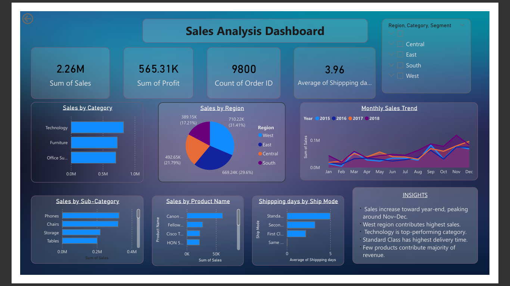

# 📊 Sales Analysis Dashboard (Power BI)

## 🔍 Project Overview

This project presents an interactive Sales Analysis Dashboard built using Power BI. It provides insights into sales performance across categories, regions, and time.

## 🛠 Tools Used

* Power BI
* Microsoft Excel

## 📈 Key Features

* KPI cards for Total Sales, Profit, Orders, and Shipping Time
* Sales analysis by Category, Sub-category, and Region
* Monthly sales trend visualization
* Top-performing products identification
* Shipping performance analysis

## 💡 Key Insights

* Sales peak during year-end months (Nov–Dec)
* West region contributes highest revenue
* Technology category is the top performer
* Standard Class shipping takes the longest time

## 📷 Dashboard Preview

## 📁 Files Included

* `.pbix` file (Power BI dashboard)
* Cleaned dataset (Excel)
* Dashboard screenshot

## 🚀 How to Use

1. Download the `.pbix` file
2. Open in Power BI Desktop
3. Explore interactive visuals and filters
